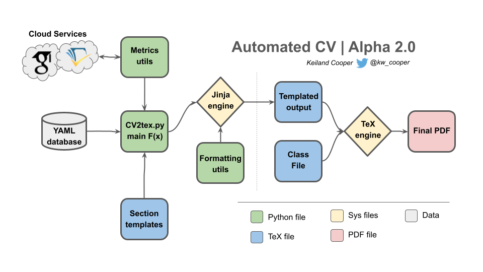
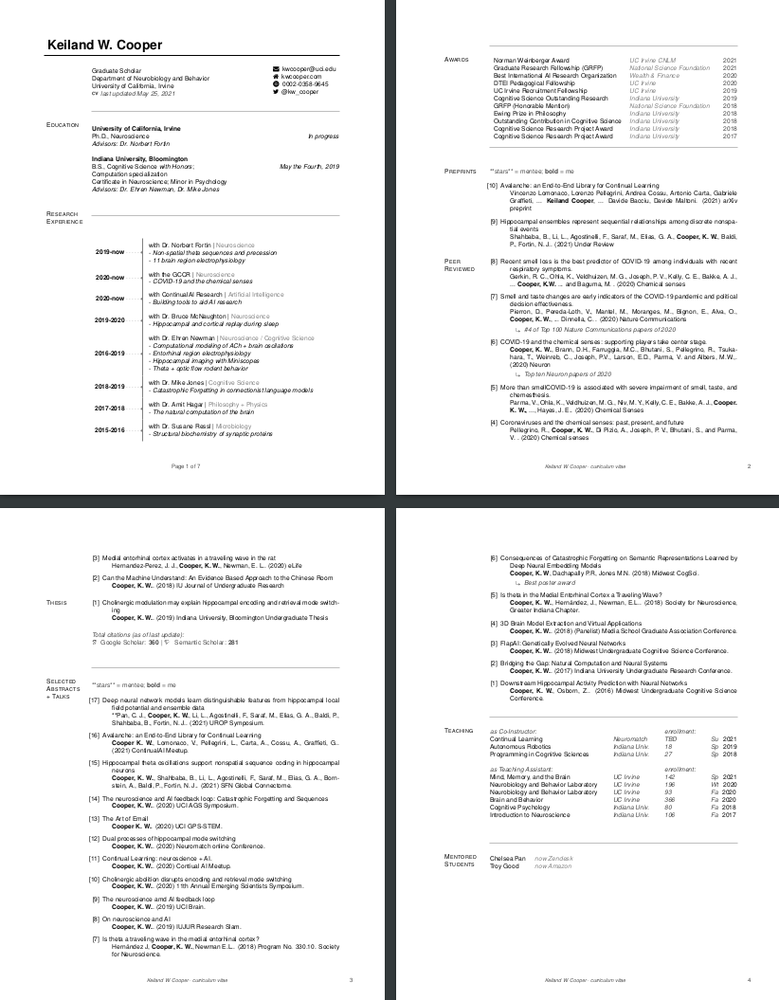

# Automated Curriculum Vitae

CV's are a great source of structured data, and automating the process seems like a logical next step. 

Here is my approach:

`CV2tex.py` is the main script, which when called converts the yaml structured data into a templated LaTeX script using Jinja. This produces a new .tex file, which can be used with PDFTeX or XeTex to produce a PDF. Added functionality in the new version includes scripts which query Google Scholar and Semantic Scholar (with more to come), to generate scholarly metrics such as citation counts and index's. 

If all that seems too complicated, and you don't want the added metric functionality or structured data, you could still use my template by just taking the output tex file and class file, editing it manually, and running it through your favorite tex engine.  

### How to install LaTeX

Copy the package from here. After that, only a few packages are needed. Python 3+ of course, including jinja2, scholarly, and semanticscholar.

Then you have to grab a copy of LaTeX:

On macOS, get pdflatex via: http://www.tug.org/mactex/ (Note: this is a big download, and there are lighter versions)

On linux, you can install it with the steps outlined [here](https://www.tug.org/texlive/quickinstall.html). The full install of TeX Live is recomended, and for full functionality, XeTeX is reccomended. 

You can confirm this installs what you need with: `which pdflatex` where you should see the path to the right file. 

For windows, you may have to Google the instructions for now... 
